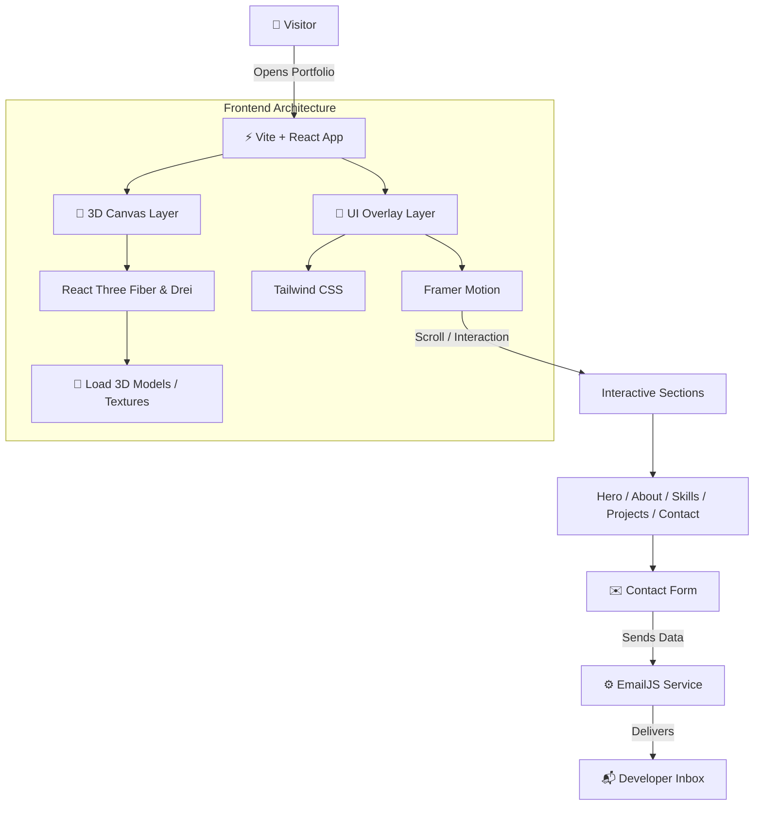

<a name="readme-top"></a>

<div align="center">


<p align="center">
  
  
  
  
  
</p>

<p align="center">
  
  
  
  
  
</p>

<p align="center">
  
  
  
  
</p>

> A modern, animated 3D developer portfolio built with React, Three.js, Tailwind CSS, and motion effects — designed to help you stand out and showcase your skills creatively.

[](#)
[](https://github.com/this-is-ankit/Portfolio)

</div>

---

## 📑 Table of Contents

- [Preview](#preview)
- [About the Project](#about)
- [Features](#features)
- [Project Highlights](#highlights)
- [Tech Stack](#tech-stack)
- [System Architecture](#architecture)
- [Technical Flow](#technical-flow)
- [Project Structure](#project-structure)
- [Getting Started](#getting-started)
- [Build for Production](#build)
- [Configuration Notes](#configuration)
- [Responsive Design](#responsive)
- [Why This Portfolio Stands Out](#why)
- [Roadmap](#roadmap)
- [Contributing](#contributing)
- [Support](#support)
- [License](#license)
- [Acknowledgements](#acknowledgements)
- [Contact](#contact)

---

<a name="preview"></a>
## 📸 Preview

<div align="center">
  
</div>

---

<a name="about"></a>
## ✨ About the Project

This is a **modern 3D developer portfolio** created to present personal skills, projects, and contact information in a visually engaging way.

The portfolio combines:
- a clean and responsive UI
- smooth motion effects
- interactive 3D visuals
- a polished contact experience

The goal of the portfolio is not just to list projects, but to create a **memorable first impression** that reflects technical skill, design sense, and attention to detail.

---

<a name="features"></a>
## 🚀 Features

### 🌌 Immersive 3D Visuals
- Built with **React Three Fiber** and **Drei**
- Interactive 3D scene integration
- Optimized WebGL rendering
- Smooth loading and camera experience

### ⚡ Motion & Animations
- Scroll-based animations using **Framer Motion**
- Fluid section transitions
- Hover effects and interaction states
- Polished entrance animations

### 🎨 Modern UI Architecture
- Responsive design with **Tailwind CSS**
- Reusable and maintainable component structure
- Mobile-first layout
- Clean visual hierarchy

### ✉️ Functional Contact Section
- Contact form powered by **EmailJS**
- Easy visitor-to-developer communication
- Frontend-only form submission flow

### 🧩 Performance-Focused Setup
- Built with **Vite**
- Fast development server
- Optimized asset delivery
- Lightweight and smooth browsing experience

---

<a name="highlights"></a>
## 🧠 Project Highlights

- 3D-inspired portfolio experience
- Animated and interactive sections
- Modern frontend stack
- Clean design and easy navigation
- Fully responsive layout
- Contact form integration
- Lightweight and fast development workflow

---

<a name="tech-stack"></a>
## 🛠️ Tech Stack

| Category | Technology | Purpose |
|----------|-----------|---------|
| Frontend | React | Component-based UI |
| Language | JavaScript / JSX | Application logic |
| Styling | Tailwind CSS | Responsive design |
| Animations | Framer Motion | Motion effects and transitions |
| 3D Rendering | Three.js / React Three Fiber | Interactive 3D visuals |
| Helpers | Drei | Utility components for R3F |
| Build Tool | Vite | Fast development and bundling |
| Forms | EmailJS | Contact form message delivery |
| UI Enhancements | Aceternity UI / Magic UI | Polished interface elements |

---

<a name="architecture"></a>
## 🏗️ System Architecture



---

<a name="technical-flow"></a>
## 📋 Technical Flow

- The app is served using **Vite** for fast startup and development.
- The UI is built with **React** components and styled using **Tailwind CSS**.
- The 3D visual layer is powered by **React Three Fiber** and **Drei**.
- **Framer Motion** handles smooth animations and transitions.
- The contact form sends messages through **EmailJS** without requiring a custom backend.
- The portfolio remains responsive across desktops, tablets, and mobile devices.

---

<a name="project-structure"></a>
## 📂 Project Structure

```
Portfolio/
├── public/
│   ├── assets/
│   ├── models/
│   └── vite.svg
├── src/
│   ├── components/
│   ├── constants/
│   ├── sections/
│   ├── App.jsx
│   ├── index.css
│   └── main.jsx
├── dist/
├── .gitignore
├── .npmrc
├── eslint.config.js
├── index.html
├── package.json
├── package-lock.json
├── tailwind.config.js
├── vite.config.js
└── README.md
```

---

<a name="getting-started"></a>
## 🚀 Getting Started

### Prerequisites

Make sure you have the following installed:

- [Node.js](https://nodejs.org/)
- npm

### Installation

```bash
git clone https://github.com/this-is-ankit/Portfolio.git
cd Portfolio
npm install
```

### Run the Development Server

```bash
npm run dev
```

The app will usually run at:

```
http://localhost:5173
```

---

<a name="build"></a>
## 📦 Build for Production

```bash
npm run build
```

To preview the production build locally:

```bash
npm run preview
```

---

<a name="configuration"></a>
## 🔧 Configuration Notes

If you are using EmailJS or any other external keys, add them to your environment/config files as needed. A typical `.env` setup looks like this:

```env
VITE_EMAILJS_SERVICE_ID=your_service_id
VITE_EMAILJS_TEMPLATE_ID=your_template_id
VITE_EMAILJS_PUBLIC_KEY=your_public_key
```

> ⚠️ Never commit your `.env` file — make sure it's listed in `.gitignore`.

---

<a name="responsive"></a>
## 🌐 Responsive Design

The portfolio is designed to work smoothly on:

- 🖥️ Desktop
- 💻 Laptop
- 📱 Tablet
- 📱 Mobile phones

It uses a mobile-first approach so that the layout stays readable and visually clean across all screen sizes.

---

<a name="why"></a>
## ✨ Why This Portfolio Stands Out

This portfolio is not a plain static webpage. It is designed to feel:

- modern
- interactive
- visually rich
- memorable

Instead of just showing information, it creates an experience that reflects creativity and technical ability.

---

<a name="roadmap"></a>
## 📈 Roadmap

- [ ] More advanced 3D scenes
- [ ] Better project filtering
- [ ] Dark/light theme toggle
- [ ] More custom animations
- [ ] Blog / articles section
- [ ] Enhanced loading experience
- [ ] Performance refinements

---

<a name="contributing"></a>
## 🤝 Contributing

This is a personal portfolio project, but suggestions and improvements are always welcome.

1. Fork the repository
2. Create a feature branch
   ```bash
   git checkout -b feature/YourFeature
   ```
3. Commit your changes
   ```bash
   git commit -m "Add: YourFeature"
   ```
4. Push to the branch
   ```bash
   git push origin feature/YourFeature
   ```
5. Open a Pull Request

---

<a name="support"></a>
## ⭐ Support

If you like this project:

- give the repository a star ⭐
- share it with others
- explore the code to learn from the implementation

[](https://star-history.com/#this-is-ankit/Portfolio&Date)

---

<a name="license"></a>
## 📜 License

This project is licensed under the [MIT License](LICENSE).

---

<a name="acknowledgements"></a>
## 🙏 Acknowledgements

Thanks to the open-source community and the amazing tools that made this project possible:

- [React](https://react.dev/)
- [Three.js](https://threejs.org/)
- [React Three Fiber](https://docs.pmnd.rs/react-three-fiber)
- [Drei](https://github.com/pmndrs/drei)
- [Framer Motion](https://www.framer.com/motion/)
- [Tailwind CSS](https://tailwindcss.com/)
- [Vite](https://vitejs.dev/)
- [EmailJS](https://www.emailjs.com/)

---

<a name="contact"></a>
## 📬 Contact

If you'd like to connect with the developer, use the contact form inside the portfolio or reach out through the social links available in the project.

<div align="center">


**Made with ❤️ by [this-is-ankit](https://github.com/this-is-ankit)**

<a href="#readme-top">⬆ Back to Top</a>

</div>